# 02 · Modelo de datos objetivo

**Qué es esto:** el diagrama ER del núcleo y qué representa cada entidad. Sale de `03-esquema.sql`,
que está validado: **37 tablas, 22 enums, 4 vistas**, orden de dependencias correcto, índice en las 55 FK.
**Lo central:** el proyecto queda como hub y aparecen tres entidades que hoy no existen — **equipo**,
**punto de conexión de red** y **composición accionaria con vigencia**.
**Hueco declarado:** la frontera **no está**. Decisión D-06 pendiente de tu confirmación (ver `01-decisiones.md`).

---

## 1 · Diagrama ER

Cinco racimos: red, proyecto, equipos, propiedad/contratos y fallas.
`PRE` marca las entidades preexistentes que se conservan intactas.

```mermaid
erDiagram
    %% ---------- RED ----------
    operadores_red            ||--o{ operadores_red_contactos : "tiene contactos"
    operadores_red            ||--o{ red_circuitos            : "opera"
    red_circuitos             ||--o{ red_puntos_conexion      : "agrupa"
    red_puntos_conexion       ||--o{ proyectos                : "conecta N plantas"
    operadores_red            ||--o{ proyectos                : "atiende"

    %% ---------- PROYECTO ----------
    portafolios               ||--o{ proyectos                : "agrupa"
    proyectos                 ||--o{ proyecto_identificacion_externa : "se identifica en"
    proyectos                 ||--o{ proyecto_simulacion      : "simula 12 meses x 3 escenarios"
    proyectos                 ||--o| proyecto_generacion_promedio    : "cachea promedio"
    proyectos                 ||--o{ proyecto_estado_historial : "pasa por estados"
    proyectos                 ||--o{ proyecto_area_contacto    : "asigna contacto por area"

    %% ---------- EQUIPOS ----------
    equipo_tipos              ||--o{ equipo_modelos           : "clasifica"
    fabricantes               ||--o{ equipo_modelos           : "fabrica"
    equipo_modelos            ||--o{ equipo_modelo_componentes : "consta de"
    equipo_tipos              ||--o{ equipo_modelo_componentes : "es componente"
    equipo_modelos            ||--o{ equipos                  : "instancia"
    equipo_tipos              ||--o{ equipos                  : "tipifica"
    proyectos                 ||--o{ equipos                  : "tiene instalados"
    equipos                   ||--o{ equipos                  : "compone / reemplaza"
    equipos                   ||--o{ equipo_mantenimientos    : "recibe"

    %% ---------- PROPIEDAD Y CONTRATOS ----------
    clientes                  ||--o{ contactos                : "tiene contactos"
    proyectos                 ||--o{ proyecto_composiciones   : "cambia de composicion"
    proyecto_composiciones    ||--|{ proyecto_composicion_lineas : "suma 100 por ciento"
    clientes                  ||--o{ proyecto_composicion_lineas : "es dueño de"
    contratos                 ||--o{ contrato_partes          : "involucra"
    clientes                  ||--o{ contrato_partes          : "actua como rol"
    contratos                 ||--o{ contrato_tarifas         : "cobra por concepto con vigencia"
    contratos                 ||--o{ contrato_proyectos       : "cubre"
    proyectos                 ||--o{ contrato_proyectos       : "esta cubierto por"
    contratos                 ||--o{ proyecto_composicion_lineas : "sustenta"
    clientes                  ||--o{ proyecto_area_contacto   : "atiende area"
    clientes                  ||--o{ equipo_mantenimientos    : "ejecuta"

    %% ---------- FALLAS ----------
    fallas                    ||--|{ falla_proyectos          : "afecta N plantas"
    proyectos                 ||--o{ falla_proyectos          : "sufre"
    fallas                    ||--o{ falla_equipos            : "involucra"
    equipos                   ||--o{ falla_equipos            : "falla en"
    fallas                    ||--o{ falla_estado_historial   : "cambia de estado"
    fallas                    ||--o{ falla_adjuntos           : "documenta"
    fallas                    ||--o{ falla_impactos           : "cuesta por planta"
    proyectos                 ||--o{ falla_impactos           : "pierde energia"
    red_puntos_conexion       ||--o{ fallas                   : "origina falla de red"
    fallas_cat_categorias     ||--o{ fallas_cat_tipos         : "PRE agrupa"
    fallas_cat_tipos          ||--o{ fallas                   : "PRE tipifica"
    fallas_cat_estados        ||--o{ fallas                   : "PRE estado actual"
    fallas_cat_estados        ||--o{ falla_estado_historial   : "PRE estado anterior y nuevo"
    fallas_cat_prioridades    ||--o{ fallas                   : "PRE prioriza"
    fallas_cat_resoluciones   ||--o{ fallas                   : "PRE resuelve"

    %% ---------- USUARIOS (PRE, fuera de alcance) ----------
    usuarios                  ||--o{ fallas                   : "PRE registra y atiende"
    usuarios                  ||--o{ falla_estado_historial    : "PRE cambia"
    usuarios                  ||--o{ falla_adjuntos            : "PRE sube"
    usuarios                  ||--o{ proyecto_estado_historial : "PRE registra"
    usuarios                  ||--o{ proyecto_composiciones    : "PRE registra"
    usuarios                  ||--o{ equipo_mantenimientos     : "PRE registra"
```

### Cardinalidades que importan

| Relación | Cardinalidad | Impuesta en base por |
|---|---|---|
| proyecto → composición accionaria | 1:N sin solapes | `EXCLUDE USING gist (proyecto_id WITH =, vigencia WITH &&)` |
| composición → líneas | 1:N, **suma 100 %** | `CONSTRAINT TRIGGER` diferido |
| proyecto → caché de generación | **1:1** | `proyecto_id` es la PK de la tabla |
| proyecto → punto de conexión | N:1 | FK `punto_conexion_id` |
| falla → proyectos | **N:M** | PK compuesta en `falla_proyectos` |
| contrato → proyectos | **N:M** | PK compuesta en `contrato_proyectos` |
| contrato → clientes por rol | N:M con rol | `UNIQUE (contrato_id, cliente_id, rol)` |
| contrato → tarifas | 1:N, **una vigente por concepto** | `EXCLUDE USING gist (contrato_id WITH =, concepto WITH =, vigencia WITH &&)` |
| equipo → equipo (componente) | jerarquía | `parent_equipo_id` autorreferencial |
| proyecto + serial → equipo | único | `UNIQUE (proyecto_id, numero_serie) WHERE numero_serie IS NOT NULL` |
| proyecto + área → contacto | 1 solo | `UNIQUE (proyecto_id, tipo)` |
| sistema externo + clave → proyecto | único en ambos sentidos | dos UNIQUE en `proyecto_identificacion_externa` |

---

## 2 · Las entidades, una por una

### 2.1 Red

**`operadores_red`** — el operador al que se conecta la planta. Deja de ser un catálogo de dos campos:
gana `nit` (UNIQUE) y `activo`. Los correos y nombres de contacto siguen en
**`operadores_red_contactos`**, que ahora tiene `UNIQUE (operador_red_id, email)` y teléfono.

**`red_circuitos`** — circuito de un operador, identificado por `UNIQUE (operador_red_id, codigo)`.
Es donde caben los «códigos de circuitos asociados» que pide el brief y que hoy no tienen dónde vivir.

**`red_puntos_conexion`** — el punto físico donde una o varias plantas entran a la red.
**Es la pieza nueva más importante del racimo:** sin ella no existe la pregunta «qué otras plantas
están colgadas de acá», y por eso hoy un corte que afecta 5 plantas son 5 fallas sueltas.
El transformador va como columna (`transformador_codigo`), no como cuarto nivel: no hay caso del negocio
que necesite distinguir dos transformadores en el mismo punto.

### 2.2 Proyecto

**`proyectos`** — sigue siendo el hub, pero baja de 61 a 29 columnas porque salen cinco subsistemas
(identidad externa, simulación, caché de generación, historial de estado y los flags derivados `srv_*`).
Lo que se queda es lo que de verdad describe la planta: nombre, clasificación, potencia AC y DC, altitud,
ubicación, red, y las fechas del ciclo de vida.

Dos columnas de estado en vez de una: `estado` (el grueso de hoy, que expone la API congelada) y
`etapa` (el ciclo de vida fino que pediste: construcción → comisionamiento → operación → comercial).
Y cinco CHECK que hoy no existen: potencias positivas, avance entre 0 y 100, lat/lon en rango,
comercialización no anterior a la entrada en operación, y comunidad energética obliga a tener nombre.

**`proyecto_identificacion_externa`** — una fila por sistema externo en lugar de 10 columnas.
`UNIQUE (proyecto_id, sistema)` impide dos claves del mismo sistema; `UNIQUE (sistema, clave)` impide que
dos plantas reclamen la misma clave. Agregar un sistema deja de ser una migración.

**`proyecto_simulacion`** — 36 filas por planta (3 escenarios × 12 meses) en vez de 3 arrays JSONB sin
validar. La BD ahora rechaza un mes 13 y un array de 11 elementos, que era lo que dejaba pasar el JSONB.

**`proyecto_generacion_promedio`** — la caché, explícitamente marcada como tal en el `COMMENT`. Sale de
`proyectos` para que nadie la confunda con un dato maestro. Conserva las 5 columnas de procedencia
(`origen`, `dias_con_datos`, `ventana_desde`, `ventana_hasta`, `actualizado_en`), que no son derivados
sino metadatos: dicen de dónde salió el número. Son exactamente los campos del contrato congelado.

**`proyecto_estado_historial`** — en qué estado y etapa estuvo la planta en cada periodo, con `EXCLUDE`
que impide dos periodos solapados. Hoy `proyectos.estado` se sobrescribe y no queda rastro.

> **La generación de los últimos 30 días no es ninguna de estas tablas.** Es una consulta sobre la serie
> (`generacion_diaria` y la API de Unergy). Lo único que se guarda es el promedio, en la caché de arriba,
> por la razón de rendimiento que ya está documentada en el código: las vistas de contratos no pueden
> llamar a la API en cada consulta. Ver D-12.

### 2.3 Equipos

Tres niveles, que es lo que separa catálogo de instancia:

| Nivel | Tabla | Qué es |
|---|---|---|
| Tipo | **`equipo_tipos`** | Qué clase de equipo existe. **Extensible por el usuario.** Declara su granularidad y el JSON Schema de sus especificaciones |
| Modelo | **`equipo_modelos`** | Marca + referencia + ficha técnica. Es catálogo: no está instalado en ninguna parte |
| Instancia | **`equipos`** | El equipo físico en una planta concreta |

**`equipo_tipos`** trae 13 valores precargados (`es_base = TRUE`): los 6 del brief, los 4 componentes de
Starlink, y medidor, transformador y reconectador, que hoy viven como columnas `marca_*` en
`proyecto_info_tecnica`. `granularidad` dice si el tipo se registra `individual` o por `cantidad`.

**`equipos`** resuelve los tres problemas del brief en una sola tabla:

- **Especificaciones heterogéneas** → `especificaciones` JSONB validado contra el esquema de su tipo.
  No es JSON sin esquema: el esquema está en la fila del tipo (D-01).
- **Cantidad vs. individual** → `cantidad` con dos CHECK: `cantidad >= 1`, y el serial solo se admite
  si `cantidad = 1`. Una fila de 480 paneles y un inversor con serial conviven en la misma tabla (D-02).
- **Componentes que fallan por separado** → `parent_equipo_id`. El componente **es** un equipo, así que
  tiene su propio serial, su propia garantía y su propia falla (D-03).

Los 4 campos comunes que pediste están: `fecha_compra`, `fecha_puesta_servicio`, `garantia_dias`,
`mantenimiento_intervalo_dias`, más `documentacion_url`.
El reemplazo **no borra historia**: el que sale recibe `fecha_baja` + `baja_motivo`, el que entra apunta
al viejo con `reemplaza_a_equipo_id`, y un CHECK obliga a que la baja esté completa (D-05).

**`equipo_mantenimientos`** — mantenimiento programado o ejecutado, con quién lo hizo. Reemplaza la tabla
`mantenimientos` (0 filas) y le agrega el vínculo con el equipo, que hoy no existe.

Los dos requisitos derivados salen por vista, no por columna:

| Pregunta del brief | Cómo se responde |
|---|---|
| ¿Qué equipos tienen la garantía por vencer? | `v_equipo_garantia_por_vencer`, sobre la columna generada `garantia_vence_el` con índice parcial |
| ¿Qué equipos tienen mantenimiento pendiente? | `v_equipo_mantenimiento_pendiente`, que cruza el intervalo con el último mantenimiento completado |

### 2.4 Clientes y propiedad

**`clientes`** y **`contactos`** se conservan casi igual; a `clientes` se le agrega un CHECK de rango en
las cuatro tasas y se le quitan las 3 columnas fantasma y el bloque bancario vacío (ver `04-mapeo.md`).

**`proyecto_composiciones`** + **`proyecto_composicion_lineas`** son la pieza crítica.
Cada cambio de propiedad crea una **composición nueva** con su rango de vigencia, no un `UPDATE`:

- «¿Quién era dueño de qué el 30 de junio?» → `WHERE proyecto_id = X AND vigencia @> '2026-06-30'::date`,
  con índice GiST sobre el rango.
- «¿Suman 100 %?» → constraint trigger diferido, verificado al COMMIT por composición.
- «¿Puede haber dos composiciones vigentes a la vez?» → no: `EXCLUDE` con `&&`.
- «¿Qué contrato sustenta esta participación?» → `contrato_id`, FK real, en vez del `contrato_ref` de texto.

Esto es lo que permite que **las liquidaciones de un periodo se calculen con la composición vigente en
ese periodo**, que es el requisito que hoy no se puede cumplir porque `fecha_inicio` está al 36,5 %.

### 2.5 Contratos

**`contratos`** — una sola tabla con `tipo` enum de 5 valores. Los cinco tipos del brief (representación,
compraventa de energía, arriendo, operación, mantenimiento) **no abren cinco tablas**.

**`contrato_partes`** — la respuesta a «cómo modelar los roles sin una tabla por tipo de contrato».
Un contrato de arriendo cuyo arrendatario no es el dueño se expresa con dos filas y ninguna columna nueva.
Los 8 roles son un enum: `propietario`, `arrendador`, `arrendatario`, `comprador`, `vendedor`, `operador`,
`mantenedor`, `representante`.

**`contrato_proyectos`** — N:M. Unifica los dos mecanismos de hoy: el escalar nullable de
`contratos_servicio` y la N:M de los PPA. Un contrato que cubre 3 plantas deja de ser 3 contratos.

**`contrato_tarifas`** — qué se cobra, por concepto y **con vigencia**. No es una columna del contrato
porque **las tarifas se renegocian**: la misma tarifa de CGM vale 5,0 en 2024, 5,26 en 2025 y 5,52826 en
2026 en los contratos de Ayura 1, indexada por IPC. Hoy ese histórico existe pero vive en cuatro JSONB
sin esquema (`indexacion_cgm`, `indexacion_representacion`, `indexacion_anual`, `indexacion_mensual`).

Cinco conceptos, como enum: `administracion`, `cgm`, `representacion`, `canon`, `energia`. Y **`unidad`
es obligatoria**, porque en los datos de hoy conviven porcentajes (administración = `0.038`, o sea 3,8 %)
y COP/kWh (CGM = `6.0`) en columnas del mismo tipo, donde son indistinguibles.

El `EXCLUDE` impide que un concepto tenga dos valores vigentes a la vez en el mismo contrato — el mismo
mecanismo que protege la composición accionaria. Con eso, **la liquidación de un periodo puede pedir la
tarifa vigente en ese periodo** en vez de la actual, que es la razón de ser de la tabla.

> **Y la relación cliente–proyecto no se duplica**, que era la otra exigencia. Un cliente llega a un
> proyecto por dos caminos que dicen cosas distintas y ninguno es redundante: por **propiedad**
> (`proyecto_composicion_lineas`) o por **contrato** (`contrato_partes` + `contrato_proyectos`).
> Hoy hay cuatro caminos y ninguno reconciliado.

### 2.6 Fallas

**`fallas`** conserva su nombre y su código interno (D-11: es ya una sola tabla de eventos, renombrarla no
compra nada). Lo que cambia es que **deja de tener `proyecto_id` escalar** y gana `origen`
(`equipo | red | evento_natural | externo`) y `punto_conexion_id`.

| Pieza nueva | Para qué |
|---|---|
| **`falla_proyectos`** | Una falla de red es **un incidente** que afecta N plantas, no N fallas duplicadas |
| **`falla_equipos`** | El equipo involucrado, por FK. Generaliza `falla_inversores`, cuya FK está al 0,3 % |
| **`falla_estado_historial`** | Historial con **estado anterior y nuevo**; hoy solo se guarda el nuevo |
| **`falla_adjuntos`** | Los «varios archivos adjuntos» del brief como entidad, no como JSONB |
| **`falla_impactos`** | Energía perdida **por planta**: si el incidente afecta a varias, el impacto es de cada una. `metodo` deja constancia de cómo se estimó |

Los cinco catálogos `fallas_cat_*` se conservan intactos; solo se le agrega el índice que le falta a
`fallas_cat_tipos.categoria_id`. Los estados que pediste (identificado, programado, resuelto, cancelado)
van sembrados en `fallas_cat_estados`, con `es_estado_final` en los dos últimos.
Los «días vigentes» salen por `v_falla_dias_vigentes`, nunca como columna.

---

## 3 · Enums y catálogos

**20 tipos ENUM**: 10 reutilizados tal cual del esquema actual (`estado_proyecto_enum`,
`clasificacion_regulatoria_enum`, `tipo_tecnologia_enum`, `tipo_proyecto_enum`, `tipo_persona_enum`,
`tipo_contacto_enum`, `estado_contrato_enum`, `periodicidad_enum`, `tipo_mantenimiento_enum`,
`estado_mantenimiento_enum`, `rol_enum`) y 9 nuevos:

| Enum nuevo | Valores |
|---|---|
| `proyecto_etapa_enum` | construccion, comisionamiento, operacion, comercial |
| `simulacion_escenario_enum` | p50, p90, p99 |
| `sistema_externo_enum` | unergy_api, solenium, sunfactory, quoia, origina, liquidaciones, tsf, cnd |
| `equipo_granularidad_enum` | individual, cantidad |
| `equipo_estado_enum` | en_bodega, instalado, en_reparacion, dado_de_baja |
| `equipo_baja_motivo_enum` | falla, obsolescencia, robo, siniestro, fin_de_vida, reemplazo_preventivo, otro |
| `contrato_tipo_enum` | representacion, compraventa_energia, arriendo, operacion, mantenimiento |
| `contrato_rol_enum` | propietario, arrendador, arrendatario, comprador, vendedor, operador, mantenedor, representante |
| `falla_origen_enum` | equipo, red, evento_natural, externo |

**Catálogos como tabla** (los administra el usuario, no un despliegue): `equipo_tipos` (13 sembrados),
`fabricantes`, `operadores_red`, `portafolios` y los 5 `fallas_cat_*` (con los 4 estados sembrados).

---

## 4 · Qué queda fuera y por qué

| Fuera del modelo | Motivo |
|---|---|
| **Frontera** | D-06 pendiente de tu confirmación. Hueco declarado en el BLOQUE 14 del DDL. **Ninguna tabla del núcleo la referencia**, así que entra después sin recrear nada |
| Liquidaciones y su panel contable | Explícitamente fuera de alcance. Lo que las condiciona: la composición versionada y `contrato_partes`. Ver `04-mapeo.md` §5 |
| Cumplimiento / MEM (`ppa_tarifas`, `ppa_compromisos_energia`, `cumplimiento_mensual`, `asic_*`, `clasificacion_energia_mensual`) | Fuera de alcance. No se rediseñan: solo cambian de FK padre a `contratos.id` |
| Comercial / CRM (`oportunidades`, `oportunidad_ofertas`, …) | Fuera de alcance, pero es el **productor** de la API congelada. Ver `05-impacto-campos-congelados.md` |
| Arriendos (`arr_*`), O&M (`om_*`), mandatos, garantías XM, series de clima y precios | Fuera de alcance. `arr_proyectos` y `finanzas_mandatos` quedan señalados como deuda: cruzan con proyectos por texto |
| `api_keys`, `audit_log`, `usuarios` | Infraestructura, no modelo de dominio. `usuarios` aparece en el DDL solo para que corra |
